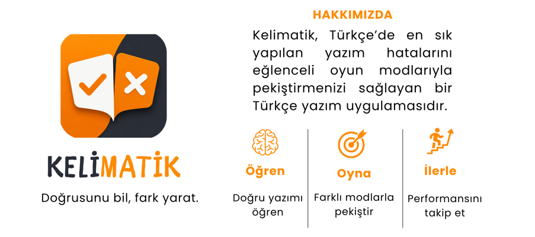

# Kelimatik

Türkçe yazımını oyunlaştıran Flutter uygulaması. Doğru / yanlış yazım çiftleri üzerinden pratik yapar; ilerleme Supabase üzerinden hesaba senkronize edilir.

## Uygulama kimliği




## Özellikler

- Çalışma modları: Klasik, Sonsuz, Seri, Yanlışlarım, Favoriler, Challenge
- Can sistemi (regen + rewarded reklam ile +1 can)
- Günlük giriş serisi ve istatistikler
- Kelime arama, favoriler, yanlış listesi
- Sıralama (liderboard)
- Google ile giriş, profil ve hesap silme
- AdMob: banner (quiz), rewarded (can bitince); UMP consent
- Yerel kelime kataloğu (`assets/data/words.json`)

## Teknik yığın

| Katman | Teknoloji |
|--------|-----------|
| UI | Flutter, Riverpod |
| Auth | Google Sign-In + Supabase Auth |
| Veri | Supabase (profil, favoriler, yanlışlar, can, streak, stats) |
| Yerel | SharedPreferences, kelime JSON |
| Reklam | google_mobile_ads (AdMob + UMP) |

Hedef platform: Android (birincil). `applicationId`: `com.kelimatik.kelimatik`

## Gereksinimler

- Flutter 3.29+ / Dart 3.7+
- Android Studio / SDK (minSdk 23+)
- Supabase projesi
- Google Cloud OAuth (Web Client ID + Android client, package + SHA-1)
- AdMob uygulaması (production App ID Manifest’te)

## Proje yapısı (özet)

```text
lib/
  core/           # tema, config (Supabase, AdMob, UMP)
  data/           # repository, sync, auth, ads servisleri
  domain/         # modeller, repository arayüzleri
  features/       # profil vb.
  presentation/   # ekranlar, provider’lar, widget’lar
assets/
  kelimatik_kimlik.png
  data/           # words.json
  icons/
  characters/
android/          # Manifest, signing, AdMob App ID
privacy-policy/   # gizlilik politikası HTML
```

## Reklamlar (AdMob)

- Debug / profile: Google test reklam birimleri (`!kReleaseMode`)
- Release: production birimler (`lib/core/config/admob_config.dart`)
- Açılış: UMP consent → Mobile Ads init → reklam yükleme
- Banner: quiz ekranı altı
- Rewarded: can bitince “Reklam izle” → tam izleme → +1 can
- Interstitial: altyapı hazır; oyun akışına bağlı değil

## Android release imzalama

1. `android/app/upload-keystore.jks` (yerel; git’e girmez)
2. `android/key.properties` (`storePassword`, `keyPassword`, `keyAlias`, `storeFile`)
3. `android/app/build.gradle.kts` release signing’i `key.properties` üzerinden okur

Release AAB çıktısı: `build/app/outputs/bundle/release/app-release.aab`

`key.properties` ve `*.jks` / `*.keystore` `.gitignore` ile hariç tutulur.

## Gizlilik

Gizlilik politikası: `https://dilara-karaca.github.io/kelimatik/privacy-policy/`

## Sürüm

`pubspec.yaml` → `1.0.0+1` (`versionName` / `versionCode`)
